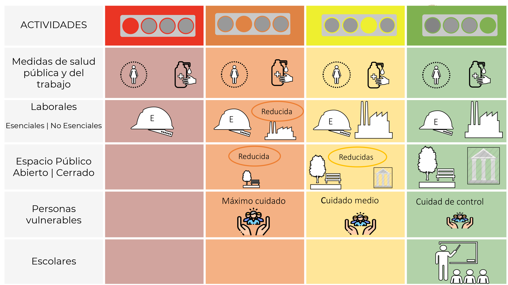

<!-- README.md is generated from README.Rmd. Please edit that file -->

```{r, include = FALSE}
knitr::opts_chunk$set(
  collapse = TRUE,
  comment = "#>",
  fig.path = "man/figures/README-",
  out.width = "100%"
)
```

# semaforos

<!-- badges: start -->
[](https://www.tidyverse.org/lifecycle/#maturing)
<!-- badges: end -->

The semaforos R package provides easy access to historical data of **Semáforos 
Epidemiológicos**, which are part of the COVID-19 response strategy of Mexico.
The semáforos define 4 levels of alert at the state level and are re-evaluated 
weekly.



## Installation

You can install the development version of semaforos from GitHub:

```{r eval = FALSE}
remotes::install_github("Bisaloo/semaforos")
```

## Usage

```{r}
library(semaforos)
```

```{r}
sw <- semaforos_get(format = "wide")
head(sw)
```

```{r}
sl <- semaforos_get(format = "long")
head(sl)
```

## Data source

The data is scraped weekly from 
[the Mexican government website](https://datos.covid-19.conacyt.mx/#SemaFE) 
using the [polite](https://dmi3kno.github.io/polite/) and the 
[rvest](https://rvest.tidyverse.org/) packages.
